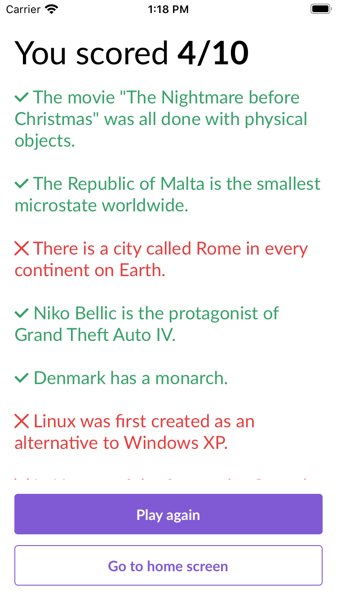

# [Quizzr]

A simple trivia app for mobile.

It's powered by React (+ TypeScript)!

You can check the full stack opening [package.json](./package.json)

## Features

### Do it in your time

This is a persistent game: you can continue where you left off!
Try it out: start a quiz and then navigate to the home page. You'll find the option to continue with the current quiz!

### It works offline

If you started a quiz, you can stop paying your internet!

## Screens

  
  
  

## What's missing

- Icons and splash screen (it's purely cosmetic and I didn't have time to do that, sorry)
- Transition animations
- Answer slider (has on the web, didn't have time to do that)
- Tests (gonna use RTL)

## License

MIT
